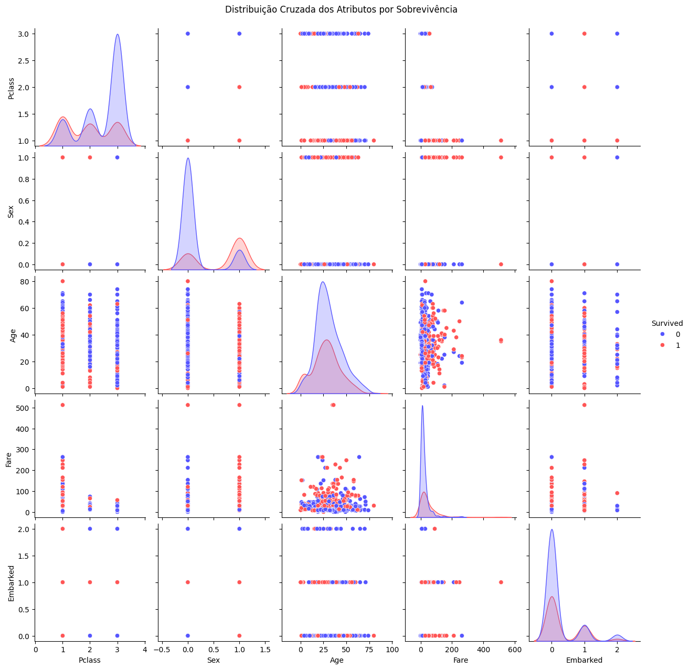
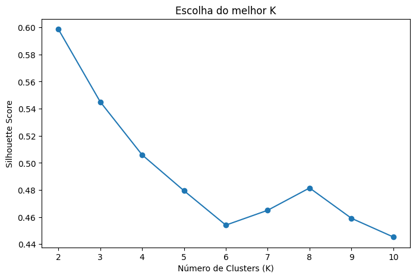
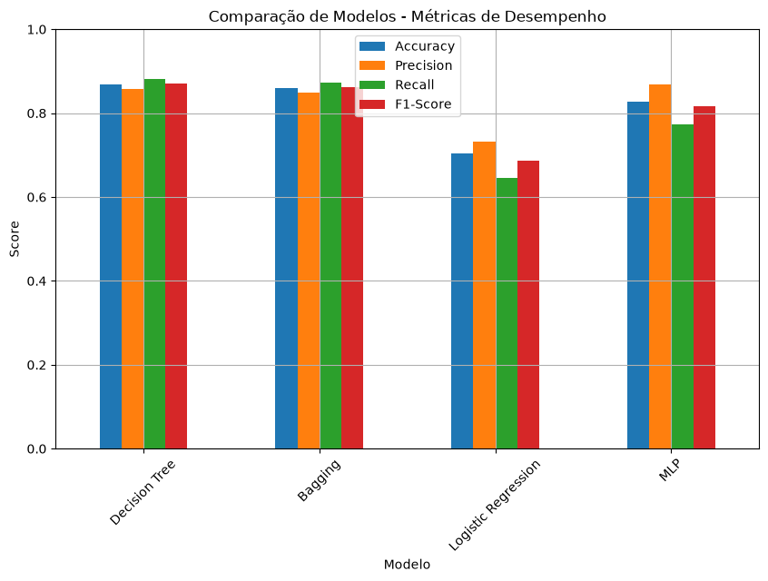

# Titanic — Survival Prediction

End-to-end machine learning project on the Titanic dataset: from raw data cleaning and unsupervised exploration to four supervised classifiers compared under stratified cross-validation.

## Overview

The goal is to predict whether a passenger survived the Titanic disaster from attributes such as ticket class, sex, age, fare and port of embarkation. The project is split in two stages:

1. **Data preparation and clustering** — attribute typing, missing-value imputation, outlier inspection, correlation analysis, min–max scaling and K-Means clustering to check whether the data has natural groups that align with survival.
2. **Supervised modelling** — four classifiers trained on a stratified train/test split, tuned over their main hyper-parameters and validated with 5-fold `StratifiedKFold`.

## Tech stack

`Python` · `pandas` · `NumPy` · `scikit-learn` · `Matplotlib` · `Seaborn` · `Jupyter`

## Results

**Cross-validation (5-fold stratified, accuracy):**

| Model | CV mean |
|---|---|
| Bagging (decision trees) | **0.860** |
| Decision Tree | 0.850 |
| Logistic Regression | 0.797 |
| MLP (32, 16) | 0.725 |

**Held-out test set:**

| Model | Accuracy | Precision | Recall | F1 |
|---|---|---|---|---|
| **Decision Tree** | **0.868** | 0.858 | **0.882** | **0.870** |
| Bagging | 0.859 | 0.850 | 0.873 | 0.861 |
| MLP | 0.827 | **0.867** | 0.773 | 0.817 |
| Logistic Regression | 0.705 | 0.732 | 0.645 | 0.686 |

- The tree-based models win on every metric except precision — the MLP is the most conservative model (highest precision, lowest recall), so it misses more actual survivors.
- Logistic Regression trails by ~16 accuracy points, which indicates the decision boundary is not linear in these features.
- K-Means reaches its best silhouette score (**0.599**) at **K = 2**, and the resulting partition is driven mainly by `Sex` and `Pclass` — the same two attributes that dominate the supervised models.
- Working dataset: 1,098 passengers, 6 predictors, no missing values after imputation.

## Visuals

| Feature distributions by survival | Silhouette score by K | Model comparison |
|---|---|---|
|  |  |  |

## How to run

```bash
python -m venv .venv
source .venv/bin/activate
pip install -r requirements.txt
jupyter lab
```

Run `notebooks/01_eda_and_clustering.ipynb` first — it writes `data/processed/titanic_prepared.csv`, which is the input of `notebooks/02_supervised_models.ipynb`.

## Data

`data/raw/titanic_modified.csv` is a modified version of the classic [Titanic dataset](https://www.kaggle.com/c/titanic/data), with additional missing values and duplicated records injected for the data-preparation exercise. Both raw and processed files are versioned here, so the notebooks run as-is.

## Project structure

```
├── data
│   ├── raw/titanic_modified.csv        # input, as received
│   └── processed/titanic_prepared.csv  # output of notebook 01
├── notebooks
│   ├── 01_eda_and_clustering.ipynb     # cleaning, EDA, scaling, K-Means
│   └── 02_supervised_models.ipynb      # training, cross-validation, metrics
└── reports/figures                     # charts exported from the notebooks
```

> Analysis and comments inside the notebooks are written in Brazilian Portuguese.
